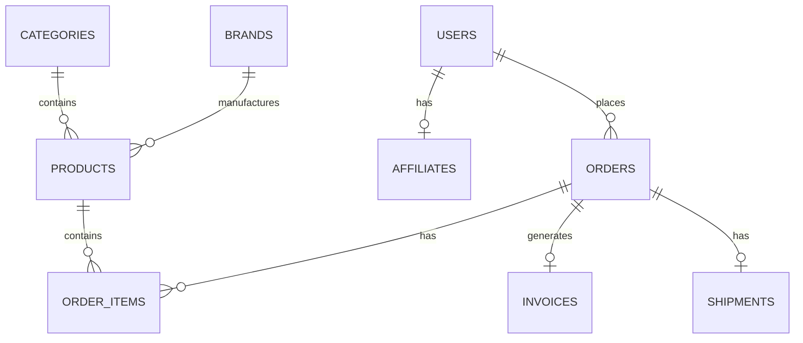

# 🏗️ البنية البرمجية - SmartShop ERP System

## نظرة عامة

SmartShop ERP هو نظام إدارة متكامل للمتاجر الإلكترونية مبني بأحدث التقنيات والهندسة المعمارية الحديثة.

## البنية التقنية

### Backend Architecture (Laravel 10)

```
api/
├── app/
│   ├── Http/
│   │   ├── Controllers/     # Controllers للـ API
│   │   ├── Middleware/      # Custom Middleware
│   │   └── Requests/        # Form Requests للتحقق
│   ├── Models/              # Eloquent Models
│   ├── Services/            # Business Logic
│   ├── Repositories/        # Data Access Layer
│   └── Providers/           # Service Providers
├── routes/
│   └── api.php             # API Routes
├── database/
│   ├── migrations/         # Database Migrations
│   └── seeders/           # Database Seeders
└── config/                # Configuration Files
```

### Frontend Architecture (Vue.js 3)

```
frontend/
├── src/
│   ├── components/         # Reusable Components
│   ├── pages/             # Page Components
│   ├── store/             # Pinia State Management
│   ├── services/          # API Services
│   ├── utils/             # Utility Functions
│   └── assets/            # Static Assets
├── public/                # Public Assets
└── dist/                  # Build Output
```

## المبادئ المعمارية

### 1. Separation of Concerns
- فصل واضح بين الطبقات المختلفة
- كل طبقة لها مسؤولية محددة
- سهولة الصيانة والتطوير

### 2. SOLID Principles
- **Single Responsibility**: كل class له مسؤولية واحدة
- **Open/Closed**: مفتوح للتوسع، مغلق للتعديل
- **Liskov Substitution**: قابل للاستبدال
- **Interface Segregation**: فصل الواجهات
- **Dependency Inversion**: عكس التبعيات

### 3. Clean Architecture
```
┌─────────────────────────────────────┐
│           Presentation Layer        │
│         (Controllers, Views)        │
├─────────────────────────────────────┤
│           Application Layer         │
│         (Services, Use Cases)       │
├─────────────────────────────────────┤
│            Domain Layer             │
│         (Models, Business Logic)    │
├─────────────────────────────────────┤
│         Infrastructure Layer        │
│    (Database, External Services)    │
└─────────────────────────────────────┘
```

## Database Design

### العلاقات الأساسية



### الجداول الرئيسية

| الجدول | الوصف | العلاقات |
|--------|-------|----------|
| users | المستخدمين | orders, affiliates, reviews |
| products | المنتجات | categories, brands, order_items |
| orders | الطلبات | users, order_items, invoices |
| categories | التصنيفات | products |
| affiliates | المسوقين | users, commissions |

## Security Architecture

### 1. Authentication & Authorization
- **Laravel Sanctum** للمصادقة
- **Spatie Laravel Permission** للصلاحيات
- JWT Tokens للـ API
- Role-based Access Control (RBAC)

### 2. Data Protection
- CSRF Protection
- SQL Injection Prevention
- XSS Protection
- Input Validation & Sanitization

### 3. API Security
- Rate Limiting
- API Versioning
- Request Validation
- Error Handling

## Performance Optimization

### Backend
- Database Indexing
- Query Optimization
- Caching (Redis)
- Lazy Loading
- Eager Loading

### Frontend
- Code Splitting
- Lazy Loading
- Image Optimization
- CDN Integration
- Service Workers

## Scalability

### Horizontal Scaling
- Load Balancing
- Database Sharding
- Microservices Architecture
- Containerization (Docker)

### Vertical Scaling
- Server Resources
- Database Optimization
- Caching Strategies
- CDN Implementation

## Monitoring & Logging

### Application Monitoring
- Error Tracking (Sentry)
- Performance Monitoring
- User Analytics
- Business Metrics

### Infrastructure Monitoring
- Server Health
- Database Performance
- API Response Times
- Error Rates

## Deployment Architecture

### Development Environment
- Local Development
- Docker Compose
- Hot Reloading
- Debug Tools

### Production Environment
- CI/CD Pipeline
- Automated Testing
- Blue-Green Deployment
- Rollback Strategy

## Future Considerations

### Microservices Migration
- Service Decomposition
- API Gateway
- Event-Driven Architecture
- Distributed Tracing

### Cloud Native
- Kubernetes Deployment
- Serverless Functions
- Cloud Storage
- Auto-scaling

---

**ملاحظة**: هذه البنية مصممة لتكون قابلة للتوسع والصيانة، مع الحفاظ على الأداء العالي والأمان. 